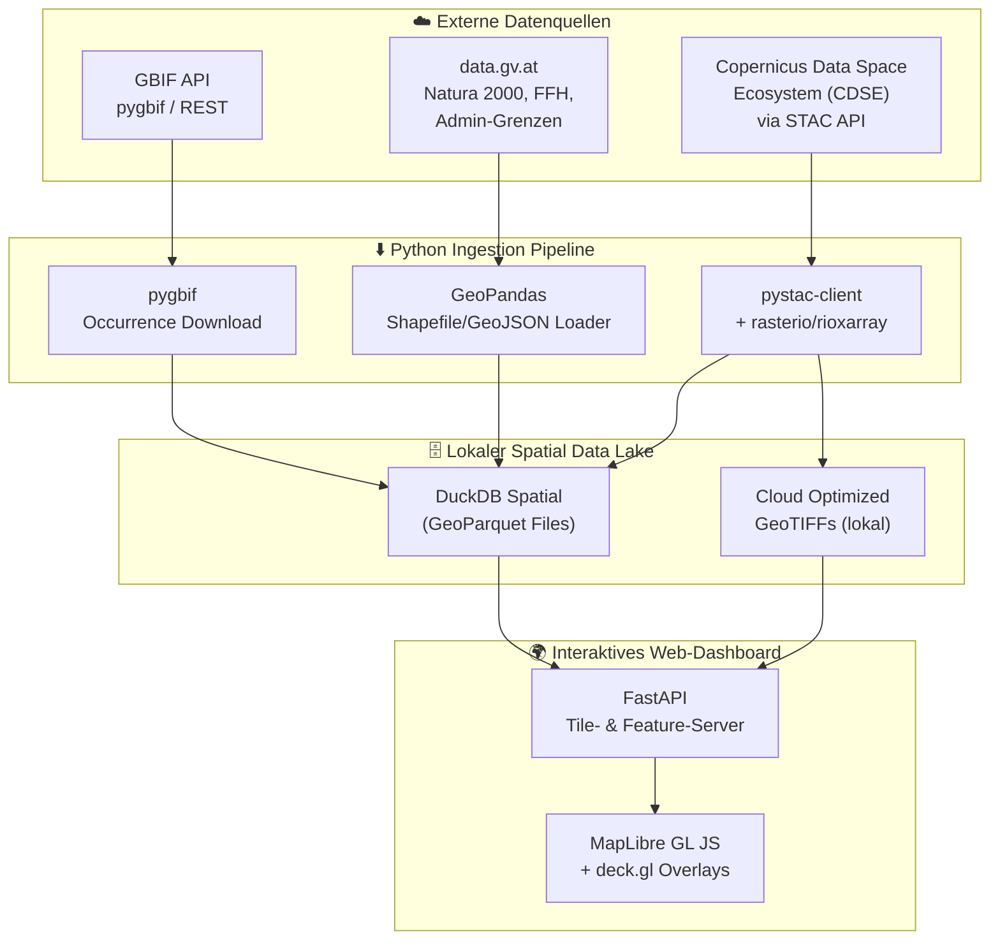
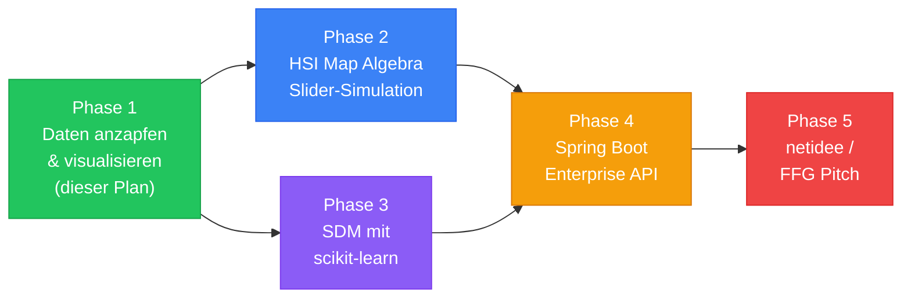

# BioDiv-Horizon — Phase 1: Daten anzapfen, verknüpfen & interaktiv erlebbar machen

## Ziel dieser Phase

Einen **lauffähigen, interaktiven Prototyp** bauen, der Copernicus-Umweltdaten (Versiegelung, Baumbestand, Grünland, Feuchtgebiete) mit GBIF-Artvorkommensdaten **räumlich verknüpft** und auf einer **interaktiven 3D-Karte Österreichs** erforschbar macht — **ohne ML-Modell, ohne Vorhersage**. Das Ergebnis ist die **Daten-Erkundungsplattform**, auf der in Phase 2 die HSI-Berechnung und in Phase 3 das SDM-Modell aufgesetzt wird.

> [!IMPORTANT]
> **Bewusste Abgrenzung:** Kein Machine Learning, kein Habitat Suitability Index, keine Slider-Simulation in Phase 1. Der Fokus liegt rein auf **Daten-Ingestion, räumlicher Verschneidung und Visualisierung**.

---

## Architektur-Übersicht (Phase 1)



---

## Tech-Stack-Entscheidung & Begründung

### Warum dieser Stack (und nicht GEE / Streamlit / PostGIS)?

| Entscheidung | Gewählt | Alternative | Begründung |
|:---|:---|:---|:---|
| **Satellitendaten-Zugang** | **CDSE STAC API + rasterio** | Google Earth Engine | CDSE ist die offizielle EU-Plattform, FFG/netidee-konform, kein Google-Lock-in. Für Phase 1 reichen voraggregierte CLMS-Produkte (kein GEE nötig). |
| **Vektordaten-Analytik** | **DuckDB Spatial + GeoParquet** | PostGIS | Serverlos, keine DB-Installation, extrem schnell für Prototyp. Für Phase 4 (Enterprise) dann PostGIS. |
| **Artdaten-API** | **pygbif (Python GBIF Client)** | Manueller CSV-Download | Programmatischer Zugriff, filterbar nach Taxon, Bounding Box, Zeitraum. |
| **Backend / API** | **FastAPI** | Flask / Django | Async, automatische OpenAPI-Docs, ideal für Tile-Serving. Passt zu deinem Docker/Microservice-Profil. |
| **Karten-Frontend** | **MapLibre GL JS + deck.gl** | Streamlit/Folium, Mapbox GL | MapLibre = Open Source (kein API-Key-Lock-in), deck.gl = 3D-Fähig (Hexagons, Extrudierte Polygone), netidee-Open-Source-konform. |
| **Paketmanagement** | **uv** | pip / conda | Schnell, reproduzierbar, lockfile-basiert. |

### Kern-Dependencies (Python)

```
# Ingestion & Spatial
pystac-client       # STAC-Katalog-Suche (CDSE, Element84)
rasterio            # GeoTIFF lesen/schreiben
rioxarray           # xarray + rasterio (Raster als DataArrays)
geopandas           # Vektor-Operationen
shapely             # Geometrie-Engine
pyproj              # CRS-Transformationen
pygbif              # GBIF API Client
duckdb              # In-Memory Spatial Analytics

# Backend
fastapi             # REST API
uvicorn             # ASGI Server
httpx               # Async HTTP Client

# Frontend (via npm / CDN)
# maplibre-gl       # Open-Source Karten-Renderer
# @deck.gl/core     # 3D Visualisierung
```

---

## Proposed Changes — Projektstruktur

### [NEW] Gesamte Projektstruktur unter `c:\Users\danie\Projekte\private\Nature IT\biodiv-horizon\`

```
biodiv-horizon/
├── pyproject.toml                    # uv-Projekt mit allen Dependencies
├── README.md                         # Projekt-Doku
├── .env.example                      # CDSE Credentials Template
│
├── data/                             # Lokaler Data Lake (git-ignored)
│   ├── raw/                          # Rohdaten (Downloads)
│   │   ├── copernicus/               # CLMS GeoTIFFs
│   │   ├── gbif/                     # GBIF Occurrence CSVs
│   │   └── admin/                    # Natura2000, FFH, Gemeindegrenzen
│   ├── processed/                    # Aufbereitete GeoParquet-Files
│   │   ├── species_occurrences.parquet
│   │   ├── environmental_layers.parquet
│   │   └── admin_boundaries.parquet
│   └── tiles/                        # Vorberechnete Raster-Tiles (PMTiles)
│
├── notebooks/                        # Explorative Jupyter Notebooks
│   ├── 01_explore_cdse_stac.ipynb    # STAC-Katalog erkunden
│   ├── 02_download_clms_layers.ipynb # Copernicus-Layer herunterladen
│   ├── 03_gbif_species_data.ipynb    # GBIF-Daten abfragen
│   ├── 04_spatial_join.ipynb         # Verschneidung Raster × Vektor
│   └── 05_duckdb_analytics.ipynb     # DuckDB-Abfragen & Statistiken
│
├── src/
│   └── biodiv_horizon/
│       ├── __init__.py
│       ├── ingestion/                # Daten-Download-Pipelines
│       │   ├── copernicus.py         # CDSE STAC → lokale COGs
│       │   ├── gbif.py               # pygbif → GeoParquet
│       │   └── admin_boundaries.py   # OGD → GeoParquet
│       ├── processing/               # Räumliche Verschneidung
│       │   ├── raster_extract.py     # Rasterwerte an Punkten extrahieren
│       │   └── spatial_join.py       # Vektor-Verschneidungen
│       ├── analytics/                # DuckDB-basierte Abfragen
│       │   └── queries.py            # Aggregationen, Statistiken
│       └── api/                      # FastAPI Backend
│           ├── main.py               # App-Entrypoint
│           ├── routes/
│           │   ├── species.py        # GET /species/{taxon}/occurrences
│           │   ├── layers.py         # GET /layers/{layer}/tiles
│           │   └── stats.py          # GET /stats/species-by-landcover
│           └── tiles.py              # Tile-Serving (COG → PNG)
│
├── frontend/                         # Statisches Web-Frontend
│   ├── index.html
│   ├── style.css
│   ├── app.js                        # MapLibre + deck.gl Integration
│   └── components/
│       ├── map.js                    # 3D-Karte
│       ├── sidebar.js                # Filter-Panel (Art, Gebiet, Layer)
│       └── charts.js                 # Statistik-Charts (z.B. Chart.js)
│
├── scripts/                          # CLI-Skripte
│   ├── download_copernicus.py        # Batch-Download CLMS
│   ├── download_gbif.py              # GBIF-Abfrage für Testarten
│   └── build_data_lake.py            # Gesamtpipeline orchestrieren
│
├── docker-compose.yml                # Optional: alles in Containern
└── Dockerfile                        # FastAPI + Frontend
```

---

## Umsetzungsschritte (6 Sprints)

### Sprint 1: Projekt-Setup & CDSE-Zugang (2–3 Tage)

#### Aufgaben
1. **uv-Projekt initialisieren** (`uv init biodiv-horizon`)
2. **CDSE-Account** anlegen unter [dataspace.copernicus.eu](https://dataspace.copernicus.eu/) (kostenlos)
3. **Erstes Notebook** `01_explore_cdse_stac.ipynb`:
   - STAC-Katalog des CDSE mit `pystac-client` durchsuchen
   - Verfügbare CLMS-Produkte für Österreich identifizieren:
     - **Imperviousness Density** (Versiegelungsgrad, 10m Auflösung)
     - **Tree Cover Density** (Baumbestand, 10m)
     - **Grassland** (Grünlandflächen)
     - **Water and Wetness** (Feuchtgebiete)
   - Bounding Box für Testgebiet festlegen (z.B. **Nationalpark Donau-Auen** oder **Mostviertel**)

#### Erwartetes Ergebnis
Ein lauffähiges Notebook, das den STAC-Katalog abfragt und die verfügbaren Datensätze mit Metadaten (Auflösung, Zeitraum, Dateigröße) auflistet.

#### Code-Skizze
```python
from pystac_client import Client

# CDSE STAC Endpoint
cdse = Client.open("https://catalogue.dataspace.copernicus.eu/stac")

# Bounding Box Österreich (grob)
austria_bbox = [9.5, 46.3, 17.2, 49.0]

# Testgebiet: Nationalpark Donau-Auen
donau_auen_bbox = [16.5, 48.08, 16.95, 48.22]

# CLMS Produkte suchen
results = cdse.search(
    collections=["CLMS"],
    bbox=donau_auen_bbox,
    datetime="2023-01-01/2023-12-31",
)
for item in results.items():
    print(item.id, item.properties.get("title"))
```

---

### Sprint 2: Copernicus-Daten herunterladen & als COG speichern (2–3 Tage)

#### Aufgaben
1. **Notebook** `02_download_clms_layers.ipynb`:
   - Die 4 CLMS-Raster-Layer für das Testgebiet herunterladen
   - Mit `rasterio` / `rioxarray` auf Testgebiet zuschneiden (clip to bounding box)
   - Als Cloud Optimized GeoTIFF (COG) lokal speichern
2. **`src/biodiv_horizon/ingestion/copernicus.py`**: Wiederverwendbare Download-Funktion

#### Erwartetes Ergebnis
4 lokale COG-Dateien unter `data/raw/copernicus/`, je ca. 5–50 MB, zugeschnitten auf das Testgebiet.

#### Code-Skizze
```python
import rioxarray
import rasterio
from rasterio.enums import Resampling

def download_and_clip_clms(
    stac_item, bbox, output_path, target_crs="EPSG:31287"
):
    """Download a CLMS layer, clip to bbox, reproject to Austrian CRS."""
    href = stac_item.assets["data"].href
    ds = rioxarray.open_rasterio(href, chunks="auto")
    clipped = ds.rio.clip_box(*bbox)
    reprojected = clipped.rio.reproject(target_crs)
    reprojected.rio.to_raster(
        output_path,
        driver="COG",
        compress="DEFLATE",
    )
```

> [!NOTE]
> **CRS-Entscheidung:** Für Österreich-bezogene Analysen empfiehlt sich **EPSG:31287** (MGI / Austria Lambert) als Projektions-CRS für metrische Berechnungen. Für die Web-Darstellung wird on-the-fly nach **EPSG:3857** (Web Mercator) reprojiziert.

---

### Sprint 3: GBIF-Artdaten für Testarten abfragen (2–3 Tage)

#### Aufgaben
1. **Notebook** `03_gbif_species_data.ipynb`:
   - Mit `pygbif` Occurrence-Daten für 3–5 **Leitarten** abfragen:
     - 🐰 **Feldhase** (*Lepus europaeus*) — Offenland-Indikator
     - 🦆 **Fasan** (*Phasianus colchicus*) — Agrarlandschaft
     - 🦋 **Admiral** (*Vanessa atalanta*) — Schmetterlingsindikator
     - 🐦 **Neuntöter** (*Lanius collurio*) — FFH-Anhang-I-Art, Halboffenland
   - Filtern: nur Österreich, nur mit GPS-Koordinaten, ab 2018
   - Datenqualität: `coordinateUncertaintyInMeters < 1000`, `basisOfRecord` = HUMAN_OBSERVATION / MACHINE_OBSERVATION
2. **`src/biodiv_horizon/ingestion/gbif.py`**: Wiederverwendbare Abfragefunktion
3. **Export als GeoParquet** nach `data/processed/species_occurrences.parquet`

#### Erwartetes Ergebnis
Ein GeoParquet mit ~10.000–100.000 Occurrence-Records, Spalten: `species`, `latitude`, `longitude`, `year`, `month`, `geometry`, `coordinateUncertainty`.

#### Code-Skizze
```python
from pygbif import occurrences as occ
import geopandas as gpd
from shapely.geometry import Point

def fetch_species_occurrences(
    taxon_key: int,
    country: str = "AT",
    year_range: str = "2018,2026",
    limit: int = 10000,
) -> gpd.GeoDataFrame:
    """Fetch GBIF occurrences for a species in Austria."""
    results = occ.search(
        taxonKey=taxon_key,
        country=country,
        year=year_range,
        hasCoordinate=True,
        coordinateUncertaintyInMeters="0,1000",
        limit=limit,
    )
    records = results["results"]
    gdf = gpd.GeoDataFrame(
        records,
        geometry=[
            Point(r["decimalLongitude"], r["decimalLatitude"])
            for r in records
        ],
        crs="EPSG:4326",
    )
    return gdf

# Taxon Keys (von GBIF Species API)
FELDHASE = 2436775
FASAN = 9515886
ADMIRAL = 1898286
NEUNTOETER = 2490450
```

---

### Sprint 4: Räumliche Verschneidung — Raster × Vektor (3–4 Tage)

> [!IMPORTANT]
> **Das ist der Kern-Sprint.** Hier entsteht der eigentliche analytische Mehrwert: Für jeden Artfundort wird extrahiert, wie die Umweltbedingungen (Versiegelung, Baumbestand, Grünland, Feuchtigkeit) an genau diesem Punkt aussehen.

#### Aufgaben
1. **Notebook** `04_spatial_join.ipynb`:
   - **Raster-Sampling (Point Extraction):** Für jeden GBIF-Fundpunkt die Werte der 4 Copernicus-Raster extrahieren
   - Mit `rasterio.sample()` oder `rasterstats.point_query()`
   - Ergebnis: Angereicherte GeoParquet-Tabelle mit Spalten `tree_cover_density`, `imperviousness`, `grassland`, `water_wetness`
2. **Notebook** `05_duckdb_analytics.ipynb`:
   - Die angereicherten Daten in DuckDB laden
   - Erste explorative Abfragen:
     - *„In welchen Versiegelungsgraden kommt der Feldhase vor?"*
     - *„Wie unterscheidet sich der mittlere Baumbestand an Fundorten von Neuntöter vs. Fasan?"*
     - *„Heatmap: Artendichte pro Gemeinde"*
3. **`src/biodiv_horizon/processing/raster_extract.py`**: Wiederverwendbares Raster-Sampling

#### Erwartetes Ergebnis
Eine analytisch nutzbare, räumlich verknüpfte Datenbasis. Beispiel-Datensatz:

| species | longitude | latitude | tree_cover_% | imperviousness_% | grassland | water_wetness | year |
|:---|:---|:---|:---|:---|:---|:---|:---|
| Lepus europaeus | 16.42 | 48.15 | 12 | 3 | 1 | 0 | 2022 |
| Vanessa atalanta | 16.38 | 48.19 | 45 | 8 | 0 | 0 | 2023 |
| Lanius collurio | 15.91 | 48.02 | 28 | 1 | 1 | 0 | 2021 |

#### Code-Skizze (Raster Extraction)
```python
import rasterio
import numpy as np

def extract_raster_values(gdf, raster_path, column_name):
    """Sample raster values at GeoDataFrame point locations."""
    with rasterio.open(raster_path) as src:
        # Reproject points to raster CRS
        points_reproj = gdf.to_crs(src.crs)
        coords = [(p.x, p.y) for p in points_reproj.geometry]
        values = list(src.sample(coords))
        gdf[column_name] = [v[0] if v[0] != src.nodata else np.nan for v in values]
    return gdf
```

#### Code-Skizze (DuckDB Analytics)
```sql
-- Mittlere Umweltbedingungen pro Art
SELECT
    species,
    COUNT(*) AS n_occurrences,
    AVG(tree_cover_pct) AS avg_tree_cover,
    AVG(imperviousness_pct) AS avg_imperviousness,
    AVG(grassland) AS avg_grassland
FROM read_parquet('data/processed/species_enriched.parquet')
GROUP BY species
ORDER BY n_occurrences DESC;
```

---

### Sprint 5: FastAPI Backend — Tile-Server & Feature-API (3–4 Tage)

#### Aufgaben
1. **`src/biodiv_horizon/api/main.py`**: FastAPI-App mit Routen:
   - `GET /api/species` → Liste der verfügbaren Arten
   - `GET /api/species/{taxon}/occurrences?bbox=...` → GeoJSON FeatureCollection der Fundorte (mit Umweltwerten)
   - `GET /api/layers/{layer}/tile/{z}/{x}/{y}.png` → Dynamische Raster-Tiles aus COGs (via `rio-tiler`)
   - `GET /api/stats/species-by-landcover` → Aggregierte Statistiken (DuckDB)
   - `GET /api/boundaries/natura2000` → Natura2000-Gebietsgrenzen als GeoJSON
2. **`rio-tiler`** für dynamisches Tile-Serving direkt aus COGs (kein Pre-Rendering nötig)
3. **CORS-Konfiguration** für lokales Frontend

#### Erwartetes Ergebnis
Ein laufender API-Server auf `localhost:8000` mit automatischer Swagger-Doku unter `/docs`.

---

### Sprint 6: Interaktives Web-Frontend — MapLibre + deck.gl (4–5 Tage)

#### Aufgaben
1. **`frontend/index.html`** + **`frontend/app.js`**:
   - **MapLibre GL JS** als Basis-Kartenrenderer (OpenStreetMap / österr. Basemap als Grundkarte)
   - **deck.gl ScatterplotLayer** für Artfundorte (farbcodiert nach Art)
   - **deck.gl HeatmapLayer** für Artendichte
   - **Raster-Overlay** für Copernicus-Layer (Versiegelung, Baumbestand) via Tile-URL vom Backend
   - **Natura2000-Gebiete** als transparente Polygon-Overlays
2. **`frontend/components/sidebar.js`**: Filter-Panel
   - Dropdown: Art auswählen (Feldhase, Fasan, Admiral, Neuntöter)
   - Toggle: Copernicus-Layer ein/ausblenden
   - Toggle: Natura2000-Grenzen ein/ausblenden
   - Slider: Zeitraum filtern (2018–2026)
3. **`frontend/components/charts.js`**: Statistik-Panel
   - Balkendiagramm: Mittlerer Versiegelungsgrad pro Art (via `/api/stats`)
   - Histogramm: Verteilung der Fundorte nach Baumbestand
4. **Popup bei Klick** auf Fundpunkt: Art, Datum, Umweltwerte an diesem Punkt

#### Erwartetes Ergebnis
Ein **visuell beeindruckendes, interaktives Dashboard**, das beim Öffnen im Browser sofort die Artfundorte auf einer 3D-Karte Österreichs zeigt, mit ein/ausblendbaren Umwelt-Layern und Statistik-Charts.

#### Design-Entscheidungen
- **Dark Mode** als Default (professioneller Look, besserer Kontrast für Kartendaten)
- **Glassmorphism**-Panel für Sidebar (halbtransparent, Blur-Effekt)
- **Farbpalette pro Art**: Feldhase = warmgold, Fasan = kupferrot, Admiral = violett, Neuntöter = teal
- **Smooth Animations** bei Layer-Wechsel und Filter-Änderungen

---

## Testgebiet-Empfehlung

> [!TIP]
> **Nationalpark Donau-Auen** (östlich von Wien) eignet sich hervorragend als Testgebiet:
> - Klare Natura2000-Grenzen vorhanden
> - Hohe Biodiversität mit allen 4 Leitarten nachgewiesen
> - Starker Gradient: Stadt (Wien) → Auwald → Agrarfläche
> - Gute GBIF-Datenlage (Citizen Science aktiv, ornitho.at)
> - Überschaubare Fläche (~93 km²) → schnelle Downloads

---

## User Review Required

> [!IMPORTANT]
> **Testgebiet:** Soll der Prototyp auf den **Nationalpark Donau-Auen** fokussiert werden, oder bevorzugst du ein anderes Gebiet (z.B. Mostviertel, Neusiedler See, ein Moorgebiet aus dem LIFE-AMooRe-Kontext)?

> [!IMPORTANT]
> **Leitarten-Auswahl:** Die vorgeschlagenen 4 Arten (Feldhase, Fasan, Admiral, Neuntöter) decken verschiedene Lebensraumtypen ab. Möchtest du andere/weitere Arten? Der Neuntöter ist als FFH-Anhang-I-Art besonders relevant für den Naturschutz-Kontext.

> [!IMPORTANT]
> **Frontend-Tiefe:** Soll das Frontend in Phase 1 schon „vorzeigbar" (netidee-Pitch-fähig) sein, oder reicht ein funktionaler Prototyp (Notebook + einfache Map), und das polierte Dashboard kommt in einer späteren Phase?

---

## Setup-TODO-Liste & Accounts für Daniel

Hier sind die organisatorischen und Account-bezogenen Vorbereitungen, die für die Durchführung der nächsten Sprints benötigt werden:

- [ ] **1. GitHub Repo anlegen (Priorität: Sofort)**
  - Auf [github.com/new](https://github.com/new) ein privates Repo namens `biodiv-horizon` anlegen.
  - *Hinweis:* Keine README / .gitignore anhaken (ist lokal bereits alles committed).
  - Anschließend: `git push -u origin main` (oder im Chat kurz Bescheid geben, damit der Push automatisch ausgeführt wird).

- [ ] **2. Lokale `.env`-Datei anlegen**
  - Vorlage kopieren: `cp .env.example .env`
  - In dieser Datei werden die Login-Daten für CDSE und GBIF eingetragen (ist per `.gitignore` vor Git geschützt).

- [ ] **3. Copernicus Data Space Ecosystem (CDSE) Account (Wichtig für Sprint 2)**
  - Kostenlos registrieren unter: [dataspace.copernicus.eu](https://dataspace.copernicus.eu/)
  - E-Mail bestätigen.
  - In `.env` eintragen:
    ```env
    CDSE_USERNAME=deine-email@domain.at
    CDSE_PASSWORD=dein-passwort
    ```
  - *Zweck:* Ermöglicht den programmatischen Download der hochauflösenden Copernicus CLMS-Rasterlayer (Versiegelung, Baumbestand etc.).

- [ ] **4. GBIF-Account anlegen (Wichtig für Sprint 3)**
  - Kostenlos registrieren unter: [gbif.org/user/profile](https://www.gbif.org/user/profile)
  - In `.env` eintragen:
    ```env
    GBIF_USERNAME=dein_gbif_nutzername
    GBIF_PASSWORD=dein_gbif_passwort
    GBIF_EMAIL=deine-email@domain.at
    ```
  - *Zweck:* Kleine Abfragen (< 10.000 Punkte) funktionieren zwar anonym, aber für vollständige Occurrence-Downloads in Österreich verlangt die GBIF-API zwingend Benutzer-Credentials.

- [ ] **5. Geodaten-Quellen (Administrative & Schutzgebietsgrenzen - Sprint 3/4)**
  - **Entscheidung:** Wir integrieren standardmäßig die offiziellen Vektordaten von [data.gv.at](https://www.data.gv.at/) und dem Umweltbundesamt (UBA):
    - Natura-2000-Gebietsgrenzen (FFH- und Vogelschutzgebiete)
    - Nationalpark-Außengrenzen
  - *Aktion für Daniel:* Keine manuelle Vorarbeit nötig — der Download wird über `src/biodiv_horizon/ingestion/admin_boundaries.py` automatisiert per Skript durchgeführt.

- [ ] **6. Hosting / Demo-Strategie (Sprint 5/6)**
  - **Status:** Für Phase 1 läuft alles **lokal via Docker Compose** / FastAPI + Webbrowser.
  - Ein Cloud-Deployment (z.B. Hetzner Cloud / Fly.io) wird optional für den späteren netidee-Pitch in Phase 5 vorbereitet.

---

## Verification Plan

### Automatisierte Checks
- `uv run pytest` — Unit-Tests für Ingestion-Funktionen (GBIF-Parsing, Raster-Clipping)
- `uv run ruff check src/` — Linting
- API-Smoke-Tests via `httpx` gegen laufenden FastAPI-Server

### Manuelle Verification
- **Notebook-Durchlauf:** Jedes der 5 Notebooks muss von oben nach unten durchlaufen und korrekte Ergebnisse liefern
- **Visueller Check:** Artfundorte müssen plausibel auf der Karte liegen (nicht im Meer, nicht systematisch verschoben)
- **Datenqualitäts-Check:** DuckDB-Aggregationen müssen plausible Werte liefern (z.B. Feldhase-Fundorte sollten niedrige Versiegelungswerte zeigen)
- **Browser-Test:** Frontend in Chrome/Firefox öffnen, Layer umschalten, Popup-Klick testen

---

## Zeitrahmen-Schätzung

| Sprint | Dauer | Kumulativ |
|:---|:---|:---|
| Sprint 1: Setup & STAC-Exploration | 2–3 Tage | ~3 Tage |
| Sprint 2: Copernicus-Download | 2–3 Tage | ~6 Tage |
| Sprint 3: GBIF-Daten | 2–3 Tage | ~9 Tage |
| Sprint 4: Räumliche Verschneidung | 3–4 Tage | ~13 Tage |
| Sprint 5: FastAPI Backend | 3–4 Tage | ~17 Tage |
| Sprint 6: Web-Frontend | 4–5 Tage | **~22 Tage** |

> [!NOTE]
> **Gesamtdauer Phase 1: ca. 3–4 Wochen** bei fokussierter Arbeit. Die Sprints 1–4 (Daten-Pipeline) können parallel zum AutoGIS-Kurs bearbeitet werden und vertiefen die dort gelernten Konzepte direkt in der Praxis.

---

## Ausblick: Was Phase 2 & 3 darauf aufbauen



- **Phase 2** nimmt die verschnittenen Daten aus Phase 1 und legt die **JSON-Gewichtungsmatrix** (HSI) drüber → Slider im Frontend ändern Rasterwerte → Karte reagiert in Echtzeit.
- **Phase 3** nutzt die Feature-Tabelle (Art + Umweltwerte) direkt als **Trainingsmatrix** für scikit-learn Random Forest → SDM-Vorhersagekarte.
- Die in Phase 1 gebaute **Daten-Pipeline und das Frontend** werden in allen Folgephasen weiterverwendet.
