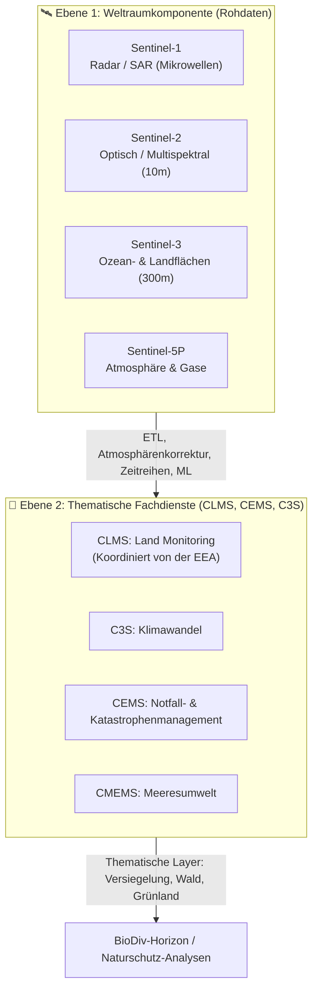
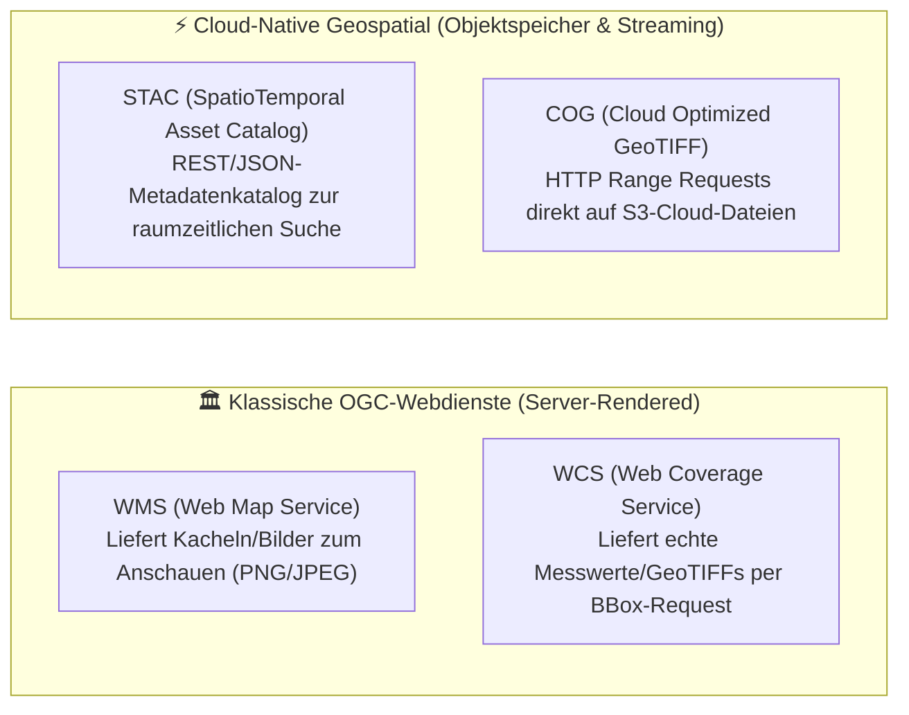
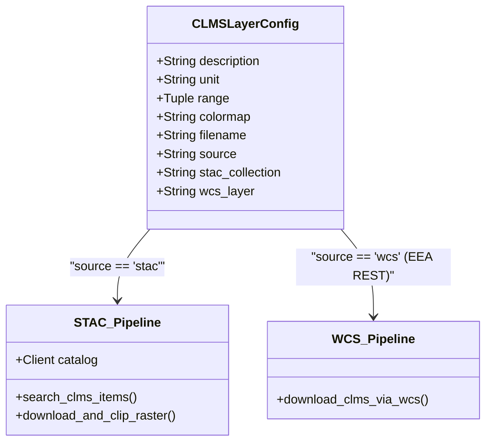
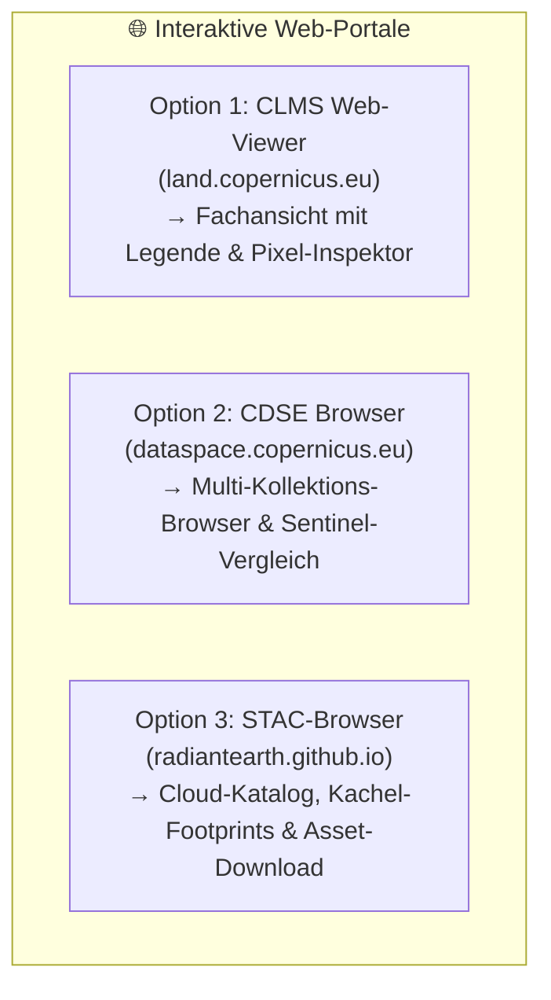
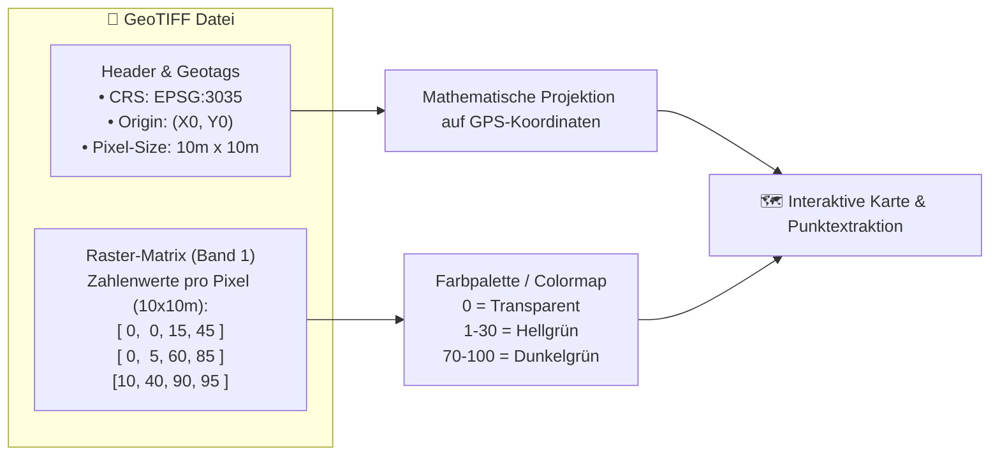
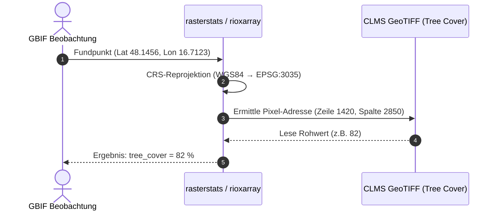
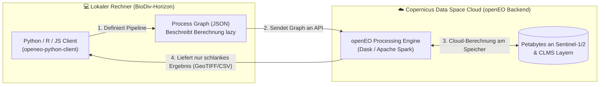

# Copernicus & Erdbeobachtung (EO) — Leitfaden für BioDiv-Horizon

> **Kontext:** Dieser Leitfaden bietet eine strukturierte Einführung in das europäische Copernicus-Ökosystem, die Sentinel-Satellitenflotte, Fachdienste (CLMS), Datenstandards (STAC, WCS, COG) und deren Rolle für das Projekt **BioDiv-Horizon**.

---

## 1. Das Copernicus-Programm im Überblick

Copernicus ist das milliardenschwere Erdbeobachtungsprogramm der Europäischen Union (EU) in Partnerschaft mit der ESA (Europäische Weltraumorganisation).

Das System ist in zwei komplementäre Ebenen unterteilt:



* **Ebene 1 (Weltraumkomponente):** Kontinuierliche Erdaufnahme der Sentinel-Flotte. Täglich fallen Dutzende Terabytes an Rohszenen an.
* **Ebene 2 (Copernicus Services):** Wissenschaftliche Konsortien und EU-Agenturen rechnen Wolken, Atmosphäreneinflüsse und Satellitenbahnen heraus und erzeugen daraus **fertige, validierte Fachdatenprodukte**.

---

## 2. Institutionen & Plattformen

| Abkürzung | Vollständiger Name | Bedeutung & Rolle |
| :--- | :--- | :--- |
| **CDSE** | **Copernicus Data Space Ecosystem** | Das zentrale Cloud-Portal und Datenarchiv der EU/ESA (seit 2023). Es bündelt alle Sentinel-Rohdaten und viele abgeleitete Services an einem Ort und bietet STAC-APIs, S3-Objektspeicher und OpenEO. |
| **EEA** | **European Environment Agency** *(Europäische Umweltagentur)* | EU-Behörde mit Sitz in Kopenhagen. Sie koordiniert und betreibt u. a. die kontinentalen europäischen Produkte des CLMS. |
| **CLMS** | **Copernicus Land Monitoring Service** | Der thematische Kerndienst für Vegetations-, Boden-, Wasser-, Schnee- und Landbedeckungsdaten (z. B. CORINE Land Cover, Urban Atlas). |
| **HRL** | **High Resolution Layers** | Spezialisierte Rasterprodukte des CLMS (10 m bis 20 m Auflösung) für Europa: *Tree Cover Density*, *Imperviousness*, *Grassland*, *Water & Wetness*, *Small Woody Features*. |
| **VLCC** | **Vegetation and Land Cover Components** | Die moderne Nachfolge- und Weiterentwicklungsserie der HRLs (ab Referenzjahr 2021/2022), die pan-europäisch jährlich mit 10 m Auflösung gerechnet wird. |

---

## 3. Datenstandards & Schnittstellen: STAC vs. WCS

In der modernen Geoinformatik gibt es zwei Welten:



### STAC (SpatioTemporal Asset Catalog)
* **Format:** JSON / GeoJSON über Standard-REST-Endpoints (`/collections`, `/search`).
* **Funktionsweise:** Du suchst per Bounding Box und Zeitraum nach Datensätzen. STAC liefert Metadaten und direkte Download- bzw. Streaming-Links (`assets`) auf Cloud-Dateien (meist COGs auf S3).
* **Vorteil:** Extrem performant, skaliert cloud-nativ und ist der de-facto Standard moderner Data Lakes.

### WCS (Web Coverage Service)
* **Format:** OGC-XML-Parameteranfragen (`REQUEST=GetCoverage&BBOX=...&FORMAT=GeoTIFF`).
* **Funktionsweise:** Der Geoserver der Behörde (z. B. EEA DiscoMap) schneidet das Raster serverseitig zu und liefert eine GeoTIFF-Datei zurück.
* **Unterschied zu WMS:** Ein **WMS** schickt nur ein Bild zur Ansicht (Farbpixel ohne Messwert). Ein **WCS** liefert die rohen Pixelwerte (z. B. Fließkommazahlen: 42 % Baumkronendichte).

### Warum nutzt BioDiv-Horizon beide Wege?
* **Tree Cover, Grassland, Forest Type (VLCC)** liegen auf **CDSE als moderne STAC-Collections** vor. Wir suchen sie via STAC und können sie als COG streamen.
* **Imperviousness (Versiegelungsgrad / HRL IMD)** wird von der **EEA** historisch über deren eigenen Geoserver (*EEA DiscoMap*) via **WCS** bereitgestellt und existiert auf CDSE nicht als STAC-Layer.
* Unser Modul `copernicus.py` abstrahiert diese Unterschiede für den Anwender komplett weg.

---

## 4. Die Data Collections im CDSE Browser

Im Web-Portal [browser.dataspace.copernicus.eu](https://browser.dataspace.copernicus.eu/) findest du folgende Hauptkollektionen:

### 🛰️ Sentinel-1 (Radar / SAR – Synthetic Aperture Radar)
* **Messprinzip:** Sendet aktiv Mikrowellen (C-Band, ~5.6 cm) aus und misst das Rückstreu-Signal.
* **Besonderheit:** **Dringt durch dichte Wolkendecken, Dunst und Dunkelheit.**
* **Ökologischer Nutzen:** Erfassung von Bodenfeuchte, Überflutungsdynamik in Auen, Bodenrauhigkeit und Vegetationsbiomasse.
* **Sentinel-1 Mosaics:** Voraggregierte, rauschreduzierte Monatskacheln, die man direkt ohne komplexe SAR-Vorverarbeitung nutzen kann.

### 🛰️ Sentinel-2 (Optisch & Nahinfrarot – Multispektral)
* **Messprinzip:** Passive Kamera mit 13 Spektralkanälen vom sichtbaren Licht (VIS) über Red-Edge bis Nahinfrarot (NIR) und kurzwelligen Infrarot (SWIR).
* **Auflösung:** 10 m (Echtfarben + NIR), 20 m (Red Edge / Vegetation), 60 m (Atmosphäre).
* **Besonderheit:** Das zentrale Arbeitsinstrument für Vegetationsökologie. Chlorophyll absorbiert rotes Licht stark und reflektiert Nahinfrarot extrem stark. Daraus entstehen Vegetationsindizes:
  $$\text{NDVI} = \frac{\text{NIR} - \text{Red}}{\text{NIR} + \text{Red}}$$
* **L1C vs. L2A:**
  * *L1C:* Top of Atmosphere (noch unkorrigiert, enthält Atmosphärendunst).
  * *L2A:* Bottom of Atmosphere (atmosphärenkorrigiert, echte Oberflächenreflexion).

### 🛰️ Sentinel-5P (Atmosphäre & Spurengase)
* **Messprinzip:** Spektrometer TROPOMI mit grober Rasterauflösung (~5.5 km × 3.5 km).
* **Was wird gemessen?** Spurengase ($NO_2$, $O_3$, $SO_2$, $CO$, $CH_4$, Formaldehyd) und Aerosole.
* **Ökologischer Nutzen:** Gut für Makro-Umweltanalysen und Emissionen, für lokale Lebensraum- und Biotopkartierung meist zu grob.

### 🏔️ Copernicus DEM (Digitales Geländemodell)
* **Was ist das?** Globales Höhenmodell (entstanden u. a. aus der deutschen TanDEM-X-Radarmission) mit 30 m bzw. 90 m Auflösung (GLO-30 / GLO-90).
* **Ökologischer Nutzen:** Essentiell für Species Distribution Models (SDM):
  * **Hangneigung (Slope):** Erosionsgefahr, Abflussverhalten.
  * **Exposition (Aspect):** Sonneneinstrahlung (Südhang vs. Nordhang), Mikroklima.
  * **Höhenstufe:** Vegetationszonierung in den Alpen.

---

## 5. Das BioDiv-Horizon Datenmodell

In `src/biodiv_horizon/config.py` ist `CLMS_LAYERS` als **Single Source of Truth** definiert:



Damit greift das System für jedes Habitat-Merkmal automatisch auf die optimale Datenquelle zu:
* **Tree Cover (10m)** $\rightarrow$ CDSE STAC
* **Grassland (10m)** $\rightarrow$ CDSE STAC
* **Forest Type (10m)** $\rightarrow$ CDSE STAC
* **Imperviousness (20m / 100m)** $\rightarrow$ EEA DiscoMap (`HRL_ImperviousnessDensity_2018`)
* **Water & Wetness (20m / 100m)** $\rightarrow$ EEA DiscoMap (`HRL_WaterWetness_2018`)

> [!NOTE]
> **EEA DiscoMap Endpunkt-Detail:**
> Die EEA betreibt ihren Kartendienst auf ArcGIS Server unter dem Ordner `GioLandPublic`. Da die OGC-Extension `WCSServer` auf der EEA-Infrastruktur serverseitig deaktiviert ist (HTTP 400), nutzt `download_clms_via_wcs` die native ArcGIS REST `exportImage`-Schnittstelle (`https://image.discomap.eea.europa.eu/arcgis/rest/services/GioLandPublic/.../ImageServer/exportImage`), die standardkonforme GeoTIFFs direkt binär (`f=image`) für jeden beliebigen Bounding-Box-Ausschnitt streamt.

---

## 6. Daten sichten: Web-Portale & Interaktive Viewer

Um Umweltdaten vorab im Browser zu erkunden, zu prüfen und mit der Realität abzugleichen, stehen drei offizielle Portale zur Verfügung:



### Option 1: Der offizielle CLMS Web-Viewer (Empfohlen für Fachanalysen)
Das Fachportal des Copernicus Land Monitoring Service ist die intuitivste Möglichkeit, Layer mit Legende und Pixel-Werten zu inspizieren:

* 🔗 **Produktseite:** [CLMS Tree Cover Density](https://land.copernicus.eu/en/products/high-resolution-layer/tree-cover-density)
* 🗺️ **Interaktive Karte:** [CLMS Map Viewer](https://land.copernicus.eu/en/products/high-resolution-layer)
* **Highlights für Naturschutz & Ökologie:**
  * **Pixel-Inspektor:** Klickst du an eine Stelle (z. B. im Nationalpark Donau-Auen), zeigt ein Pop-up den exakten Prozentwert der Überschirmung (z. B. `85 %`).
  * **Zeitsprünge:** Vergleich der Referenzjahre (z. B. 2018 vs. 2021), um Kahlschläge, Sukzession oder Schäden nachzuvollziehen.
  * **Thematische Legenden:** Vordefinierte, wissenschaftlich abgestimmte Farbpaletten.

### Option 2: CDSE Browser (`browser.dataspace.copernicus.eu`)
Das zentrale Portal für alle Roh- und abgeleiteten Copernicus-Daten:

* 🔗 **Link:** [browser.dataspace.copernicus.eu](https://browser.dataspace.copernicus.eu/)
* **So navigierst du zu CLMS-Daten:**
  1. Zoome in das Zielgebiet (z. B. östlich von Wien / Donau-Auen).
  2. Klicke links auf den Reiter **"Search"** / "Discover".
  3. Scrolle in den Collections nach unten zu **Copernicus Services** $\rightarrow$ **CLMS (Land)**.
  4. Wähle z. B. `clms_vlcc_tree-cover-density_europe_10m_yearly_v1`.
  5. Klicke auf **"Search"** und dann bei den Kacheln auf **"Visualize"**, um den Layer über das Geländebild zu legen.

### Option 3: STAC-Browser (Entwickler- & Data-Engineering-Sicht)
Visuelle Repräsentation des cloud-nativen STAC-Katalogs:

* 🔗 **Link:** [STAC Browser für TCD 10m Europe](https://radiantearth.github.io/stac-browser/#/external/catalogue.dataspace.copernicus.eu/stac/collections/clms_vlcc_tree-cover-density_europe_10m_yearly_v1?.asset=asset-data)
* **Nutzen:** Zeigt die exakten geometrischen Footprints der Kacheln (`E48N28` etc.), JSON-Metadaten, zeitliche Gültigkeiten und direkte Download-/Streaming-URLs der GeoTIFF-Assets.

---

## 7. GeoTIFF & Rasterdaten unter der Haube

### Was ist ein GeoTIFF wirklich? (2D-Datenmatrix statt Foto)

Im Unterschied zu einem Urlaubsfoto (JPEG/PNG mit Farbwerten `#FF0000`) ist ein **GeoTIFF im GIS-Bereich eine 2D-Tabelle / ein numerisches Array von Rohmesswerten (`int[][]` oder `float[][]`) mit Georeferenzierungs-Informationen im Header**.



1. **Die Datei:** Deckt eine ganze Kachel ab (z. B. $10.000 \times 10.000$ Pixel = $100 \times 100\text{ km}$).
2. **Ein Pixel:** Repräsentiert eine Bodenfläche von **10 m × 10 m** (die räumliche Auflösung).
3. **Der Pixelwert (Single Band):**
   * `0`: 0 % Baumkronenüberschirmung (z. B. Acker, Wiese, Wasser).
   * `45`: 45 % Baumkronenüberschirmung.
   * `100`: 100 % geschlossener Kronenraum (dichter Wald).
   * `255`: **NoData-Wert** (z. B. außerhalb des europäischen Erfassungsgebiets, Wolkenfehler).

> **Wichtig:** Farben existieren **nicht** in der GeoTIFF-Datei! Die Farben entstehen erst beim Rendering durch die Anwendung einer **Colormap** (z. B. `Greens` oder `YlGn`). Dadurch bleibt der Originalmesswert erhalten und kann für mathematische Berechnungen genutzt werden.

---

### Das "Geo" im GeoTIFF: Georeferenzierung & Transformation

Ein Standard-TIFF-Bild hat nur Pixelkoordinaten (Zeile $y$, Spalte $x$). Das GeoTIFF speichert im Header eine **Affine Transformation** und ein **CRS**:

$$\begin{pmatrix} X_{\text{Welt}} \\ Y_{\text{Welt}} \end{pmatrix} = \begin{pmatrix} X_{\text{Origin}} \\ Y_{\text{Origin}} \end{pmatrix} + \begin{pmatrix} \Delta x & 0 \\ 0 & -\Delta y \end{pmatrix} \begin{pmatrix} \text{Spalte} \\ \text{Zeile} \end{pmatrix}$$

* **CRS (Coordinate Reference System):** z. B. `EPSG:3035` (ETRS89 / LAEA Europe – metrisches System für Europa) oder `EPSG:31287` (MGI Austria Lambert).
* **Origin ($X_0, Y_0$):** Die exakte metrische Koordinate der linken oberen Ecke von Pixel `[0, 0]`.
* **Pixelgröße ($\Delta x, \Delta y$):** z. B. $+10.0\text{ m}$ nach Osten, $-10.0\text{ m}$ nach Süden.

---

### Cloud Optimized GeoTIFF (COG) & Streaming

Die modernen CLMS-Dateien auf CDSE sind als **Cloud Optimized GeoTIFF (COG)** formatiert:

* **Interne Kachelung (Tiling):** Statt Bilddaten zeilenweise zu speichern, sind die Pixel in handlichen Blöcken (z. B. $512 \times 512$ Pixel) organisiert.
* **Integrierte Pyramiden (Overview Levels):** Die Datei enthält bereits herunterskalierte Vorschaustufen (z. B. 20m, 40m, 80m, 160m).
* **HTTP Range Requests:** Ein Client (wie Python `rioxarray` oder der Browser) muss nicht die 2 GB große Gesamtdatei herunterladen. Er sendet gezielte HTTP-Header (`Range: bytes=102400-204800`) und lädt **nur exakt die Kacheln für den gewünschten Kartenausschnitt** (z. B. Nationalpark Donau-Auen = wenige Megabytes).

---

### Punktextraktion: Verschneidung mit GBIF-Fundpunkten

Für das Biodiversitäts-Monitoring (z. B. Neuntöter 🐦 oder Feldhase 🐰) verschneidet das System Artfunde mit den Raster-Messwerten:



Durch diese Array-Indexierung dauert die Anreicherung von Tausenden Tierbeobachtungen mit Umweltvariablen nur wenige Millisekunden.

---

## 8. openEO: Der europäische Standard für Cloud-Processing

Im Notebook `01_explore_cdse_stac.ipynb` taucht in Abschnitt 5 **openEO** auf. Doch was unterscheidet openEO von STAC oder WCS?

### 1. Das Kernproblem vor openEO: Vendor Lock-in & "Data Gravity"

* **Datenvolumen (Data Gravity):** Ein Jahr Sentinel-2-Daten für Österreich umfasst mehrere Terabyte. Diese Daten auf lokale Rechner herunterzuladen, nur um einen Vegetationsindex (NDVI) zu berechnen, ist ineffizient und bandbreitenintensiv.
* **Plattform-Silos:** Vor openEO musste man Algorithmen für jedes Backend neu schreiben (Google Earth Engine API, Sentinel Hub Scripting, AWS Lambda, EODC).

### 2. Das openEO-Prinzip: "Bring the Code to the Data"

**openEO** ist ein von der EU und ESA geförderter, offener Standard (maßgeblich mitentwickelt an der TU Wien und EODC). Er definiert eine einheitliche Spezifikation, um Erdbeobachtungsdaten **direkt in der Cloud** auszuwerten:



### 3. Schlüsselkonzepte in openEO

1. **Spatio-Temporal Data Cubes (Raster-Datenwürfel):**
   openEO modelliert Satellitendaten als 4-dimensionale Würfel:
   $$\text{Cube}(x, y, \text{Band}, \text{Zeit})$$
   Man wählt ein Raumfenster (z. B. Nationalpark Donau-Auen), ein Zeitfenster (z. B. Mai bis August 2024) und die Kanäle (Rot & NIR).
2. **Lazy Evaluation & Process Graphs:**
   Methodenaufrufe wie `cube.filter_bands()`, `cube.reduce_dimension()` oder `(nir - red) / (nir + red)` führen **keine lokale Berechnung** aus. Sie bauen einen mathematischen Berechnungsgraphen (DAG in JSON) auf.
3. **Ausführung in der Cloud:**
   * **Synchrone Abfrage (`download()`):** Für kleine Gebiete und schnelle Checks. Die Cloud rechnet das Ergebnis ad-hoc und streamt das fertige TIFF zurück.
   * **Batch Jobs (`create_job()`):** Für landesweite Analysen (ganz Österreich). Der Job wird in der CDSE-Cloud eingereiht, läuft auf verteilten Clustern, und benachrichtigt nach Abschluss.

### 4. Code-Beispiel: NDVI-Zeitreihe direkt in der Cloud rechnen

```python
import openeo

# 1. Verbindung zum kostenlosen CDSE openEO-Endpunkt herstellen
conn = openeo.connect("https://openeo.dataspace.copernicus.eu")
conn.authenticate_oidc()  # Nutzt CDSE-Account

# 2. Raum-zeitlichen Datenwürfel definieren (Nationalpark Donau-Auen)
donau_auen_bbox = {"west": 16.5, "south": 48.08, "east": 16.95, "north": 48.22, "crs": "EPSG:4326"}

cube = conn.load_collection(
    "SENTINEL2_L2A",
    spatial_extent=donau_auen_bbox,
    temporal_extent=["2024-05-01", "2024-08-31"],
    bands=["B04", "B08", "SCL"],  # Rot, NIR, Scene Classification
)

# 3. Wolken filtern (SCL: 4=Vegetation, 5=Boden)
cloud_mask = ~cube.band("SCL").isin([4, 5])
clean_cube = cube.mask(cloud_mask)

# 4. NDVI berechnen und zeitlichen Median bilden
red = clean_cube.band("B04")
nir = clean_cube.band("B08")
ndvi = (nir - red) / (nir + red)
median_ndvi = ndvi.reduce_dimension(dimension="t", reducer="median")

# 5. Nur das fertige 2D-Ergebnis (wenige Megabytes) herunterladen
median_ndvi.download("donau_auen_ndvi_sommer2024.tif")
```

---

### 5. Wann nutzen wir was? (Der Copernicus-Werkzeugkasten)

| Anwendungsfall | Beste Schnittstelle | Typisches Tool / Library | Vorteil |
| :--- | :--- | :--- | :--- |
| **Fertige Vegetations-/Waldlayer (10m)** | **CDSE STAC** | `pystac_client`, `rioxarray` | Direkter Zugriff auf fertige europäische CLMS-Rasterkacheln; Streaming per COG. |
| **Versiegelung & Feuchte (Ausschnitt)** | **EEA REST / WCS** | `requests`, `rioxarray` | Schneller BBox-Zuschnitt für Layer, die auf CDSE STAC noch nicht isoliert vorliegen. |
| **Individuelle Spektralanalysen & Zeitreihen** | **openEO (CDSE)** | `openeo` Python SDK | Cloud-native Berechnung direkt am Rohdatenspeicher (kein Download von Roh-Szenen). |
| **Manuelle Sichtung & Validierung** | **CLMS Web Portal / CDSE Browser** | Web-Browser | Interaktiver Pixel-Inspektor, Legenden und sofortige visuelle Plausibilisierung. |

